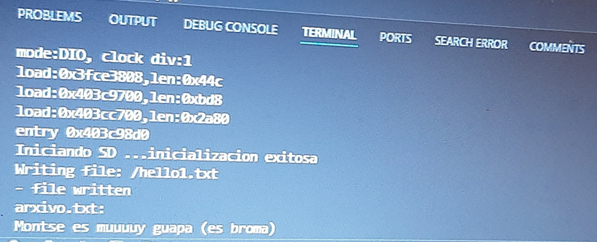

# Práctica 6 parte 1

## Código

```c++

#include <Arduino.h>
//bool SDFS::begin(uint8_t ssPin, SPIClass &spi, uint32_t frequency, const char * mountpoint, uint8_t max_files, bool format_if_empty)
//    void begin(int8_t sck=-1, int8_t miso=-1, int8_t mosi=-1, int8_t ss=-1);
//  1000, "/sd", 5 ,true 

#include <SPI.h>
#include <SD.h>
File myFile;
//File file1;

void writeFile(fs::FS &fs, const char * path, const char * message){
    Serial.printf("Writing file: %s\r\n", path);

    File file = fs.open(path, FILE_WRITE);
    if(!file){
        Serial.println("- failed to open file for writing");
        return;
    }
    if(file.print(message)){
        Serial.println("- file written");
    } else {
        Serial.println("- write failed");
    }
    file.close();
}

void setup()
{
  Serial.begin(115200);
  SPI.begin(36, 37, 35);
  Serial.print("Iniciando SD ...");
  if (!SD.begin(39, SPI)) {
    Serial.println("No se pudo inicializar");
  return;
  }

  Serial.println("inicializacion exitosa");
  writeFile(SD, "/hello1.txt", "Hello world 1, PD"); // Create a hello1.txt file with the content "Hello world 1, PD"

  myFile = SD.open("/arxivo.txt");//abrimos el archivo 
  if (myFile) {
    Serial.println("arxivo.txt:");
  while (myFile.available()) {
    Serial.write(myFile.read());
  }
  myFile.close(); //cerramos el archivo
  } else {
    Serial.println("Error al abrir el arxivo");
  }
}
void loop()
{
}
```
## Descripción

Este código nos muestra cómo usar una tarjeta SD para escibir y leer.

Primero, se han añadido dos bibliotecas nuevas; **SPI.h**, que se usa para la comunicación SPI y **SD.h** que se usa para acceder a la tarjeta SD.

Se decalra una variable myFile de tipo File para manejar el archivo.

La función **writeFile** se usa para escibir un mensaje en el archivo.

En la función **setup()** se inicia la comunicación serial y la comunicación SPI.
Si al inicializar la tarjeta SD hay un error, se imprime un mensaje conforme no se ha podido inicializar y la ejecución se detiene. Por lo contrario si la inicialización ha tenido éxito, se imprime un mensaje conforme la inicialización ha sido exitosa.
Acto seguido se  llama a la función writeFile() para escribir un mensaje en un archivo llamado hello1.txt, en este se escribirá "Hello world 1, PD".
Finalmente se abre y se lee el archivo arxivo.txt y se muestra por el puerto serie lo que contiene.

La función **loop()** está vacía porque el programa no realiza ninguna acción, solo espera indefinidamente.

Imagen del puerto serie:



## Conclusión

En conclusión este código inicializa una tarjeta SD, escribe un archivo de texto ("hello1.txt") en la tarjeta y lee y muestra contenido por el puerto serie de otro archivo de texto ("arxivo.txt") que se encuentra en la tarjeta.