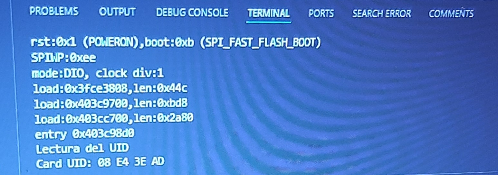
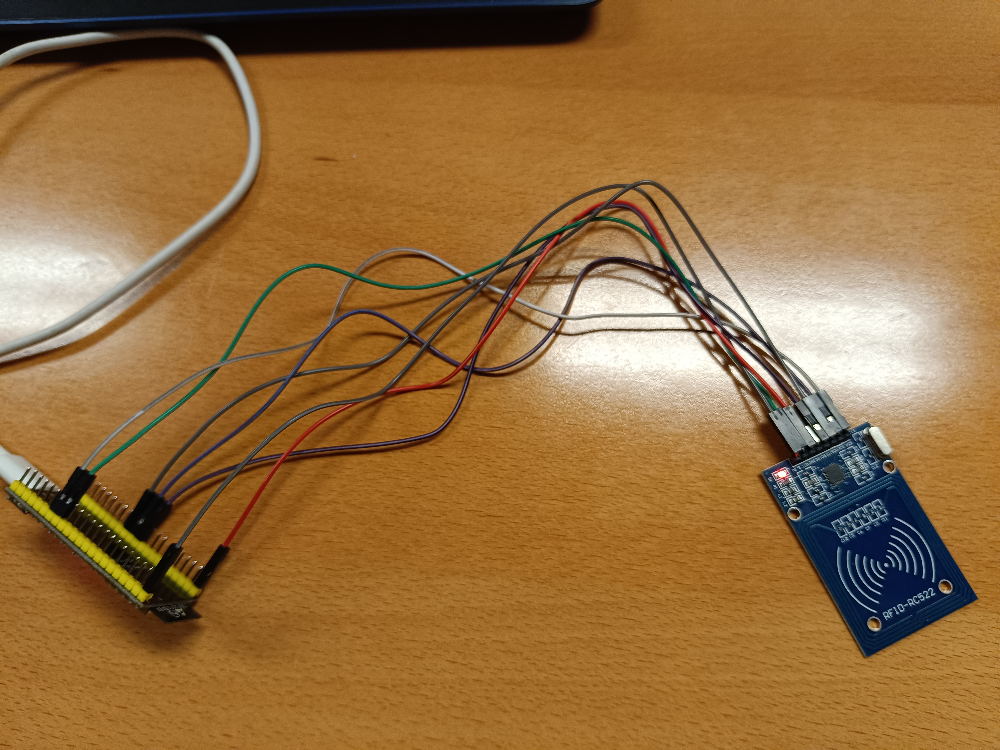

# Práctica 6 parte 2

## Código

```c++
#include <Arduino.h>

#include <SPI.h>
#include <MFRC522.h>
#define RST_PIN 9 //Pin 9 para el reset del RC522
#define SS_PIN 10 //Pin 10 para el SS (SDA) del RC522
MFRC522 mfrc522(SS_PIN, RST_PIN); //Creamos el objeto para el RC522
void setup() {
  Serial.begin(115200); //Iniciamos la comunicación serial
  SPI.begin(36, 37, 35); //Iniciamos el Bus SPI
  mfrc522.PCD_Init(); // Iniciamos el MFRC522
  Serial.println("Lectura del UID");
}
void loop() {
  // Revisamos si hay nuevas tarjetas presentes
  if ( mfrc522.PICC_IsNewCardPresent()) 
  { 
    //Seleccionamos una tarjeta
    if ( mfrc522.PICC_ReadCardSerial()) 
    {
      // Enviamos serialemente su UID
      Serial.print("Card UID:");
      for (byte i = 0; i < mfrc522.uid.size; i++) {
        Serial.print(mfrc522.uid.uidByte[i] < 0x10 ? " 0"
        : " ");
        Serial.print(mfrc522.uid.uidByte[i], HEX); 
      } 
      Serial.println();
      // Terminamos la lectura de la tarjeta actual
      mfrc522.PICC_HaltA(); 
    } 
  } 
}

```
## Descripción

Hemos usado una libreria (MFRC522) para leer las tarjetas RFID y mostrar su identificador único (UID) a través del puerto serial.

Primero hemos añadido al proyecto la libreria necesaria para poder manejar la tarjeta RFID y hemos usado otra para la comunicación SPI. Luego hemos definido los pines que se usan para la comunicación con la tarjeta RFID y hemos creado un objeto usando estos pines.

En la función **setup()** iniciamos la velocidad, la comunicación SPI y el MFRC522.

Usamos la función **loop()** para verificar si hay una tarjeta RFID y lo hace con la función PICC_IsNewCardPresent(). Si detecta una tarjeta la lee con la función PICC_ReadCardSerial() y luego muestra su UID en formato hexadecimal.

Imagen del puerto serie: 



En este caso ha detectado una tarjeta con UID 08 E4 3E AD 

Imagen del montaje:




## Conclusión

En conclusión se establece una comunicación con el lector RFID, se verifica si hay tarjetas presentes y si hay muestra su UID por el puerto serie.


